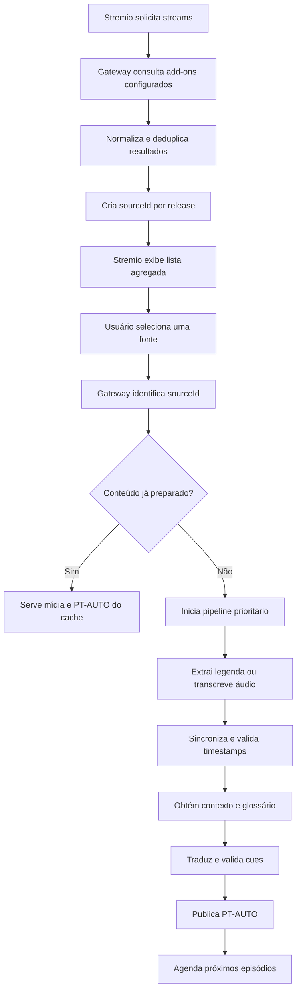
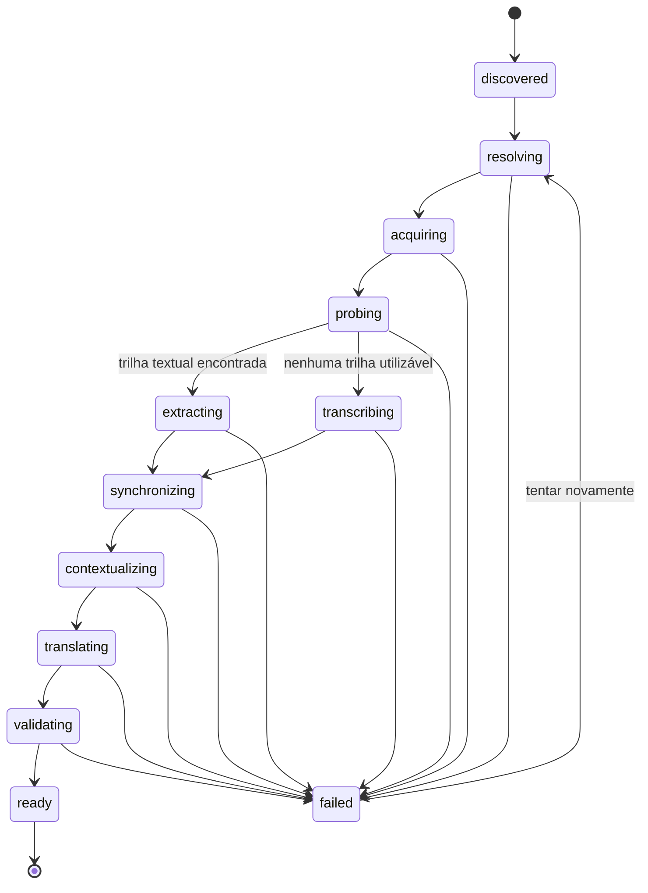

# Gateway de mídia e legendas contextuais para Stremio

## 1. Visão do projeto

Este projeto tem como objetivo construir um add-on intermediário para o Stremio capaz de agregar streams oferecidos por outros add-ons, identificar exatamente qual fonte foi escolhida pelo usuário e preparar uma versão consumível com legenda em português brasileiro.

O sistema não depende da existência de uma legenda no OpenSubtitles ou em outro catálogo. Quando nenhuma legenda adequada estiver disponível, ele deve ser capaz de extrair uma trilha embutida ou transcrever o áudio, sincronizar o texto, traduzir com contexto e disponibilizar o resultado ao Stremio.

Além da reprodução imediata, o projeto deverá permitir preparar episódios antecipadamente, manter vídeo e legendas no armazenamento local e continuar oferecendo o conteúdo preparado quando a fonte original estiver indisponível.

O produto-alvo é, portanto, mais amplo que um add-on de legendas. Ele é um **gateway de preparação de mídia** composto por:

- agregador de add-ons de stream;
- identificador e resolvedor de fontes;
- pipeline de extração, transcrição, sincronização e tradução;
- gerenciador de downloads e armazenamento;
- biblioteca local para reprodução posterior;
- painel de acompanhamento e administração.

> O código atualmente existente no repositório é um esqueleto legado e serve apenas como referência inicial. Ele não representa a arquitetura final descrita neste documento.

## 2. Problema que o projeto resolve

O usuário pode encontrar um filme ou episódio disponível para reprodução, mas sem legenda no idioma desejado. Catálogos como OpenSubtitles, SubDL e outros podem não possuir nenhuma legenda para aquela obra ou para a versão específica do arquivo.

Um add-on de legendas convencional não consegue resolver completamente esse problema porque normalmente recebe apenas o ID do conteúdo e alguns metadados do arquivo. Ele não recebe automaticamente a URL retornada por outro add-on de streams.

Este projeto contorna essa limitação atuando como o próprio add-on de streams:

1. o Stremio consulta este projeto;
2. este projeto consulta Torrentio ou outros add-ons configurados;
3. os resultados são normalizados e devolvidos com identificadores internos;
4. o usuário escolhe uma fonte;
5. o projeto passa a conhecer exatamente o arquivo ou stream escolhido;
6. o pipeline prepara a legenda e, quando solicitado, armazena também a mídia.

## 3. Objetivos funcionais

### 3.1 Agregação de streams

- Aceitar uma ou mais URLs de add-ons compatíveis com o protocolo do Stremio.
- Consultar os add-ons configurados usando o mesmo tipo e ID recebido do Stremio.
- Combinar, deduplicar e ordenar os resultados.
- Preservar informações relevantes como nome, descrição, resolução, codec, tamanho, `infoHash`, `fileIdx`, `filename`, `videoHash` e `bingeGroup`.
- Identificar o add-on de origem de cada resultado.
- Aceitar filmes e séries identificados por IDs IMDb iniciados em `tt`.
- Interpretar episódios no formato `tt1234567:temporada:episodio`.

### 3.2 Identificação da fonte selecionada

- Criar um `sourceId` estável para cada versão encontrada.
- Não usar a URL temporária como identidade permanente.
- Detectar qual stream foi selecionado quando o Stremio acessar a rota de reprodução.
- Associar a legenda à versão exata do arquivo selecionado.
- Reutilizar um resultado já preparado quando a mesma release voltar a aparecer com outra URL temporária.

Uma identidade de fonte poderá considerar:

```text
addon de origem + infoHash + fileIdx + filename + tamanho
```

Para fontes sem torrent, deverá ser usada uma combinação de metadados estáveis e, quando possível, um checksum parcial do conteúdo.

### 3.3 Aquisição e inspeção da mídia

- Resolver redirecionamentos e URLs temporárias somente quando necessário.
- Suportar leitura parcial por HTTP Range.
- Inspecionar contêiner, duração, faixas de áudio e faixas de legenda com `ffprobe`.
- Ler arquivos locais, URLs HTTP/HTTPS, HLS e DASH dentro dos limites de cada formato.
- Diferenciar legendas textuais de legendas gráficas.
- Evitar obrigar o tráfego completo do vídeo a passar pelo servidor quando uma URL direta puder ser entregue ao player.

### 3.4 Obtenção da legenda original

O sistema seguirá esta ordem de preferência:

1. legenda textual embutida e já sincronizada;
2. legenda externa encontrada em provedores configurados;
3. legenda aproximada de outra release, seguida de sincronização;
4. transcrição do áudio quando nenhuma legenda aproveitável existir.

Formatos textuais inicialmente desejados:

- WebVTT;
- SRT;
- ASS/SSA;
- TTML, quando tecnicamente viável.

Legendas PGS, VobSub e outros formatos baseados em imagem exigirão OCR e ficarão fora do primeiro MVP.

### 3.5 Transcrição e alinhamento

- Extrair apenas o áudio necessário para o processamento.
- Detectar o idioma falado.
- Usar reconhecimento de fala com timestamps.
- Aplicar VAD para reduzir silêncio e alucinações.
- Opcionalmente produzir timestamps por palavra e identificação de falantes.
- Quando existir uma legenda externa, alinhá-la ao áudio antes da tradução.
- Nunca alterar os timestamps durante a tradução.

Ferramentas candidatas:

- `faster-whisper` para transcrição eficiente;
- WhisperX para alinhamento por palavra e diarização;
- `ffsubsync` como primeira opção para sincronização de uma legenda existente;
- ALASS ou outro mecanismo como fallback para casos de alinhamento mais complexo.

### 3.6 Tradução contextual

- Produzir português brasileiro natural, e não apenas tradução literal.
- Utilizar metadados estruturados da obra.
- Considerar falas anteriores e seguintes ao traduzir cada lote.
- Preservar nomes próprios, termos fictícios e escolhas recorrentes.
- Manter glossário por filme, série e temporada.
- Permitir correções manuais e reaproveitá-las em episódios futuros.
- Versionar modelo, prompt e glossário para permitir reprocessamento controlado.

O contexto poderá incluir:

- título original e título localizado;
- ano de lançamento;
- sinopse;
- gênero e tom da obra;
- idioma original;
- série, temporada, episódio e título do episódio;
- resumo do episódio;
- personagens, atores, lugares e organizações;
- glossário específico da obra;
- termos corrigidos anteriormente pelo usuário.

A ordem recomendada para obtenção de contexto é:

1. Cinemeta, usando o IMDb ID já recebido do Stremio;
2. provedores estruturados adicionais, como TMDB;
3. cache local de contexto e glossário;
4. pesquisa na internet somente como enriquecimento ou fallback.

O tradutor deverá trabalhar com uma estrutura validável, por exemplo:

```json
{
  "context": {
    "title": "Nome da série",
    "episode": "S02E05",
    "characters": ["Alice", "Robert"],
    "glossary": {
      "The Order": "A Ordem"
    }
  },
  "cues": [
    { "id": 101, "text": "You betrayed the Order." },
    { "id": 102, "text": "I had no choice." }
  ]
}
```

O sistema deverá validar que todos os IDs retornaram exatamente uma vez. Timestamps e identificadores não deverão ser enviados como campos editáveis pelo modelo.

### 3.7 Preparação antecipada de episódios

- Permitir configurar quantos episódios seguintes serão preparados.
- Usar a lista de vídeos da série fornecida pelo Cinemeta para encontrar os próximos IDs.
- Consultar novamente os add-ons de origem para cada episódio.
- Aplicar um perfil de seleção de release.
- Enfileirar prefetch com prioridade inferior ao conteúdo solicitado diretamente pelo usuário.
- Não repetir download, transcrição ou tradução já concluídos.

O perfil de seleção poderá definir:

- resolução máxima ou preferida;
- codec de vídeo;
- codec e idioma do áudio;
- HDR/Dolby Vision;
- tamanho máximo;
- preferência por cache de serviço debrid;
- preferência pelo mesmo grupo de release;
- fontes e add-ons prioritários;
- termos obrigatórios ou proibidos no nome da release.

### 3.8 Biblioteca e reprodução offline

- Armazenar vídeo, áudio intermediário, legenda original, legenda sincronizada e tradução final separadamente.
- Servir vídeos locais com suporte correto a HTTP Range.
- Devolver resultados locais antes dos resultados online.
- Continuar disponibilizando um item local mesmo quando o add-on de origem estiver indisponível.
- Permitir baixar as legendas produzidas independentemente do vídeo.
- Aplicar política de retenção, limite de disco e limpeza explícita.

Neste projeto, **offline** significa armazenado na máquina ou servidor onde o serviço está executando. Outros dispositivos ainda precisarão alcançar esse servidor por rede local, domínio ou VPN.

O armazenamento de mídia deverá ser usado somente para fontes que o usuário esteja autorizado a salvar.

### 3.9 Painel de gerenciamento

O painel deverá apresentar:

- filmes, séries e episódios conhecidos;
- resultados encontrados em cada add-on;
- release selecionada;
- estado atual do processamento;
- progresso e duração de cada etapa;
- fila ativa, histórico, falhas e tentativas;
- velocidade e progresso de download;
- uso e limite de armazenamento;
- trilhas de áudio e legenda detectadas;
- legenda original, sincronizada e traduzida;
- contexto e glossário utilizados;
- pré-visualização e edição de cues;
- ações de preparar, pausar, cancelar, tentar novamente e excluir;
- configuração do número de episódios seguintes;
- download manual dos artefatos gerados.

O painel não deverá expor URLs assinadas, tokens de add-ons ou credenciais nos logs exibidos.

## 4. Fluxo principal



## 5. Estados do processamento

Cada preparação deverá ser uma máquina de estados persistente e retomável:



Cada etapa deverá persistir seu resultado. Uma falha na tradução não poderá exigir novo download ou nova transcrição.

## 6. Arquitetura proposta

### 6.1 Componentes

#### API e add-on Stremio

Responsabilidades:

- servir o manifesto;
- receber consultas de streams;
- consultar add-ons upstream;
- normalizar resultados;
- criar e resolver `sourceId`;
- entregar streams, legendas e arquivos locais;
- oferecer a API do painel;
- autenticar usuários e assinar rotas.

Tecnologia proposta: Node.js, Express e Stremio Add-on SDK.

#### Orquestrador de jobs

Responsabilidades:

- controlar a máquina de estados;
- aplicar prioridades;
- evitar trabalhos duplicados;
- retomar trabalhos interrompidos;
- disparar prefetch;
- registrar progresso e falhas.

Tecnologia inicial proposta: BullMQ e Redis, corrigindo o uso legado presente no repositório.

#### Worker de mídia

Responsabilidades:

- executar `ffprobe` e FFmpeg;
- extrair áudio e legendas;
- normalizar formatos;
- sincronizar legendas;
- produzir artefatos finais.

O processamento deverá ser assíncrono e não bloquear o processo HTTP.

#### Worker de inteligência

Responsabilidades:

- detectar idioma;
- transcrever áudio;
- alinhar palavras quando necessário;
- traduzir com contexto;
- validar respostas do modelo;
- atualizar memória de tradução e glossário.

Tecnologia proposta: serviço Python separado, facilitando o uso de faster-whisper, WhisperX e bibliotecas de alinhamento.

#### Banco de dados

Responsabilidades:

- perfis de usuário;
- add-ons configurados;
- conteúdos e episódios;
- fontes e releases;
- mídia local;
- artefatos de legenda;
- contexto e glossários;
- jobs, tentativas e progresso;
- políticas de armazenamento e prefetch.

SQLite é suficiente para a primeira versão de uso pessoal. PostgreSQL será preferível se houver múltiplos usuários ou múltiplas instâncias.

#### Armazenamento de arquivos

Estrutura conceitual:

```text
storage/
  media/<mediaId>/video.ext
  subtitles/<subtitleId>/original.ext
  subtitles/<subtitleId>/normalized.vtt
  subtitles/<subtitleId>/synced.vtt
  subtitles/<subtitleId>/pt-BR.vtt
  audio/<mediaId>/processing-audio.flac
  context/<contentId>/context.json
```

Os nomes reais no disco deverão usar IDs internos seguros, nunca valores fornecidos diretamente pelo usuário.

## 7. Modelo de dados conceitual

### Content

- `id` interno;
- tipo: filme ou série;
- IMDb ID;
- título, ano e idioma original;
- metadados brutos e contexto normalizado.

### Episode

- conteúdo pai;
- temporada e episódio;
- video ID do Stremio;
- título, descrição e data;
- anterior e próximo episódio.

### UpstreamAddon

- nome;
- URL do manifesto ou endpoint configurado;
- credencial protegida;
- prioridade;
- estado de saúde;
- recursos e tipos suportados.

### Source

- `sourceId` estável;
- conteúdo ou episódio;
- add-on de origem;
- `infoHash`, `fileIdx` ou referência HTTP;
- filename, tamanho e metadados técnicos;
- release group e perfil de qualidade;
- referência temporária atual;
- data de expiração da referência.

### MediaAsset

- source associado;
- caminho local;
- checksum;
- tamanho, duração e formato;
- estado de aquisição;
- política de retenção.

### SubtitleAsset

- source associado;
- origem: embutida, provedor ou ASR;
- idioma original;
- formato;
- checksum do conteúdo;
- estado de sincronização;
- versão de tradução;
- arquivos produzidos.

### ProcessingJob

- tipo e prioridade;
- estado e etapa atual;
- progresso;
- número de tentativas;
- erros sanitizados;
- timestamps;
- dependências e artefatos concluídos.

## 8. Rotas propostas

As rotas ainda poderão mudar durante a implementação.

### Protocolo Stremio

```text
GET /manifest.json
GET /stream/:type/:videoId.json
GET /subtitles/:type/:videoId/:extra.json
```

### Reprodução e legendas vinculadas à fonte

```text
GET /play/:sourceId
GET /assets/subtitles/:subtitleId/:variant.vtt
GET /assets/media/:mediaId
```

### API administrativa

```text
GET    /api/jobs
GET    /api/jobs/:jobId
POST   /api/sources/:sourceId/prepare
POST   /api/jobs/:jobId/retry
POST   /api/jobs/:jobId/cancel
GET    /api/library
GET    /api/contents/:contentId
GET    /api/episodes/:episodeId
PATCH  /api/subtitles/:subtitleId
POST   /api/subtitles/:subtitleId/retranslate
DELETE /api/media/:mediaId
GET    /api/storage
PATCH  /api/settings
```

## 9. Estratégia de cache e deduplicação

- Cachear respostas de add-ons upstream por pouco tempo.
- Não persistir indefinidamente URLs assinadas ou resolvidas.
- Identificar mídia por release e conteúdo, não apenas por URL.
- Identificar legenda original pelo hash de seu conteúdo.
- Identificar tradução por:

```text
hash da legenda original
+ idioma de destino
+ versão do modelo
+ versão do prompt
+ versão do glossário
```

- Reutilizar extração, transcrição e sincronização quando somente a tradução mudar.
- Usar locks por `sourceId` para impedir dois workers de processarem a mesma mídia.
- Manter estado de placeholder separado do arquivo final.

## 10. Segurança e privacidade

Requisitos obrigatórios:

- não aceitar destinos arbitrários em um proxy público;
- permitir somente protocolos e domínios autorizados;
- bloquear SSRF para loopback, rede privada, metadados de nuvem e outros destinos internos;
- não incluir a URL de origem completa em query strings públicas;
- não registrar tokens, cookies, credenciais ou URLs assinadas;
- armazenar configurações sensíveis protegidas;
- usar IDs opacos nas rotas públicas;
- assinar URLs com expiração;
- aplicar autenticação ao painel e às APIs administrativas;
- limitar concorrência, tamanho, duração e taxa de requisições;
- validar todos os caminhos de arquivo;
- manter FFmpeg e workers isolados do processo HTTP;
- definir cota de armazenamento por usuário ou perfil;
- disponibilizar limpeza e exclusão de dados;
- servir remotamente somente com HTTPS e CORS correto.

## 11. Observabilidade

O sistema deverá registrar métricas úteis sem expor segredos:

- duração por etapa;
- quantidade de jobs por estado;
- taxa de sucesso e falha;
- cache hit por tipo de artefato;
- bytes baixados e armazenados;
- velocidade de aquisição;
- tempo de transcrição por minuto de mídia;
- custo e quantidade de caracteres/tokens traduzidos;
- origem escolhida para cada legenda;
- espaço livre e projeção de armazenamento;
- saúde de Redis, banco, FFmpeg, worker de IA e add-ons upstream.

Logs deverão usar IDs internos e nomes sanitizados. A URL completa de uma fonte nunca deverá aparecer em logs normais.

## 12. Problemas conhecidos no esqueleto atual

Antes de reutilizar o código existente, os seguintes problemas precisam ser resolvidos:

1. O manifesto usa `idPrefixes: ["rdpt"]`, incompatível com o fluxo normal do Cinemeta baseado em IDs `tt`.
2. Os handlers esperam `args.extra.rdUrl` ou `args.extra.url`, valores que o Stremio não fornece automaticamente nesse cenário.
3. O código não consulta nenhum add-on upstream.
4. O Docker Compose inicia apenas o servidor HTTP e não inicia o worker.
5. A imagem Docker não instala FFmpeg ou `ffprobe`.
6. O worker usa `QueueScheduler`, removido das versões modernas do BullMQ.
7. O video ID de episódios contém `:`, caractere proibido em um `jobId` personalizado do BullMQ.
8. O placeholder usa o mesmo arquivo `pt-auto.vtt` do resultado final e pode ser confundido com cache pronto.
9. A configuração de rate limit existe, mas não é aplicada ao worker.
10. O proxy aceita destinos arbitrários e pode se tornar um proxy aberto ou vetor de SSRF.
11. O logger HTTP pode registrar a URL completa contida no query string.
12. DASH suporta somente casos simples com `BaseURL`.
13. A concatenação HLS pode repetir cabeçalhos WebVTT e perder informações de timestamp.
14. A tradução por sentinela textual é frágil e pode retornar as falas originais silenciosamente.
15. Não existem testes automatizados.

## 13. Decisões arquiteturais iniciais

Estas decisões são propostas como ponto de partida:

1. O projeto será um **wrapper/agregador de streams**, não apenas um add-on passivo de legendas.
2. O primeiro upstream deverá ser um add-on compatível com a API de streams do Stremio.
3. O `sourceId` será a identidade central de toda preparação.
4. O vídeo não será proxyado integralmente por padrão.
5. Processamento de mídia será assíncrono, persistente e retomável.
6. Transcrição será o fallback obrigatório quando não houver legenda textual.
7. Sincronização acontecerá antes da tradução.
8. A tradução alterará somente texto, nunca timestamps.
9. Contexto estruturado terá prioridade sobre pesquisa livre na internet.
10. O cache será baseado em conteúdo e versão de processamento.
11. Resultados locais aparecerão antes das fontes online.
12. Download de episódios seguintes será configurável e terá prioridade baixa.

## 14. Questões ainda em aberto

As seguintes decisões deverão ser tomadas durante a implementação:

- qual add-on upstream será suportado primeiro;
- como configurar URLs personalizadas que contenham credenciais;
- se torrents serão obtidos por serviço debrid, cliente torrent local ou ambos;
- qual provedor/modelo será usado inicialmente para tradução;
- qual modelo Whisper será o padrão para CPU e GPU;
- se o MVP usará somente SQLite ou já começará com PostgreSQL;
- se o painel será incorporado ao mesmo projeto ou será uma aplicação separada;
- quanto tempo o endpoint de legenda poderá aguardar um job antes de retornar;
- como o Stremio será informado de que uma legenda terminou sem exigir recarregar excessivamente;
- política padrão de retenção e limite de armazenamento;
- suporte inicial a HLS, DASH e arquivos remotos completos;
- estratégia para releases com múltiplos cortes ou cenas diferentes;
- se OCR para PGS/VobSub fará parte de uma versão futura.

## 15. Plano de implementação

### Fase 0 — Fundação e segurança

- [ ] Criar configuração tipada e validada.
- [ ] Atualizar dependências e remover APIs obsoletas.
- [ ] Corrigir Docker e adicionar health checks.
- [ ] Adicionar FFmpeg à imagem do worker.
- [ ] Separar API, worker de mídia e worker de IA.
- [ ] Criar banco e migrações iniciais.
- [ ] Criar autenticação básica do painel.
- [ ] Implementar logs sanitizados.
- [ ] Adicionar testes e integração contínua.

Critério de conclusão: todos os serviços sobem de forma reproduzível e executam um job simples persistente sem expor segredos.

### Fase 1 — Agregador funcional

- [ ] Corrigir manifesto para IDs IMDb.
- [ ] Implementar configuração de add-on upstream.
- [ ] Consultar e combinar streams de um upstream.
- [ ] Normalizar respostas e preservar `behaviorHints`.
- [ ] Criar `sourceId` e persistir fontes.
- [ ] Reescrever streams com rotas internas seguras.
- [ ] Identificar a fonte selecionada.
- [ ] Manter reprodução direta sem proxy integral quando possível.

Critério de conclusão: o usuário instala somente este add-on e consegue visualizar e reproduzir os resultados do upstream através dele.

### Fase 2 — Primeira PT-AUTO completa

- [ ] Inspecionar arquivos HTTP e locais com `ffprobe`.
- [ ] Extrair legendas textuais embutidas.
- [ ] Normalizar SRT/ASS/VTT.
- [ ] Extrair áudio quando não houver legenda.
- [ ] Integrar faster-whisper ou WhisperX.
- [ ] Gerar WebVTT válido.
- [ ] Associar a legenda ao `sourceId` correto.
- [ ] Servir o VTT ao Stremio com URL assinada.
- [ ] Persistir todos os estados e artefatos.

Critério de conclusão: uma fonte sem legenda externa produz uma PT-AUTO sincronizada a partir do próprio áudio.

### Fase 3 — Contexto, tradução e qualidade

- [ ] Consultar metadados no Cinemeta.
- [ ] Criar documento de contexto por obra e episódio.
- [ ] Implementar glossário persistente.
- [ ] Traduzir em JSON com IDs estáveis.
- [ ] Incluir janelas de contexto entre lotes.
- [ ] Validar contagem, ordem, tamanho e integridade dos cues.
- [ ] Integrar sincronização de legendas externas com `ffsubsync`.
- [ ] Criar métricas e relatório de qualidade.
- [ ] Permitir correção e retradução.

Critério de conclusão: a tradução mantém termos consistentes, preserva todos os timestamps e pode ser reproduzida ou auditada.

### Fase 4 — Painel operacional

- [ ] Criar listagem de conteúdos, fontes e jobs.
- [ ] Exibir progresso por etapa.
- [ ] Adicionar cancelamento, retry e reprocessamento.
- [ ] Mostrar e editar contexto e glossário.
- [ ] Pré-visualizar legenda original e traduzida.
- [ ] Exibir armazenamento, logs sanitizados e saúde dos serviços.
- [ ] Permitir baixar artefatos.

Critério de conclusão: todo o pipeline pode ser acompanhado e administrado sem acessar diretamente banco, arquivos ou terminal.

### Fase 5 — Biblioteca offline e prefetch

- [ ] Implementar download persistente de mídia autorizada.
- [ ] Servir arquivos locais com Range.
- [ ] Priorizar resultados locais no add-on.
- [x] Descobrir próximos episódios pelo Cinemeta.
- [x] Criar perfil de seleção automática de release.
- [x] Preparar os próximos N episódios.
- [ ] Aplicar limite de armazenamento e retenção.
- [ ] Implementar limpeza segura e explícita.

Critério de conclusão: episódios configurados são preparados antecipadamente e continuam reproduzíveis a partir da biblioteca local.

### Fase 6 — Expansões

- [ ] Múltiplos add-ons upstream.
- [ ] Múltiplos usuários e perfis.
- [ ] PostgreSQL e workers distribuídos.
- [ ] OCR para legendas gráficas.
- [ ] DASH e HLS avançados.
- [ ] Diarização e estilos por personagem.
- [ ] Memória de tradução compartilhada entre episódios.
- [ ] Notificações de conclusão.
- [ ] Suporte a GPU remota.

## 16. Estratégia de testes

### Testes unitários

- parser de video IDs;
- normalização de streams;
- geração de `sourceId`;
- deduplicação;
- seleção automática de release;
- conversão e validação de cues;
- construção de lotes de tradução;
- validação de resposta contextual;
- assinatura e expiração de URLs;
- sanitização de logs e caminhos.

### Testes de integração

- consulta a um add-on upstream simulado;
- resolução de redirects e Range;
- Redis e fila;
- banco de dados e retomada de job;
- FFmpeg com fixtures pequenas;
- extração de SRT, ASS e VTT;
- transcrição curta e determinística;
- tradução com provedor simulado;
- entrega de stream e legenda pelo protocolo Stremio.

### Testes ponta a ponta

- filme com legenda embutida;
- episódio sem nenhuma legenda;
- legenda externa fora de sincronia;
- URL que expira e é resolvida novamente;
- reinício do servidor durante uma tradução;
- prefetch de episódios;
- reprodução de arquivo offline quando o upstream está indisponível;
- tentativa de SSRF ou uso como proxy aberto;
- esgotamento de espaço em disco.

## 17. Riscos e limitações

- Transcrição completa pode demorar em máquinas sem GPU.
- O Stremio pode carregar uma legenda externa antes de ela ficar pronta e não atualizar automaticamente; o produto precisará definir uma experiência clara de preparação e nova seleção.
- URLs de serviços debrid normalmente expiram e não devem ser tratadas como identidade da mídia.
- Torrents retornados apenas como `infoHash` exigem um cliente torrent local ou um serviço capaz de resolvê-los.
- Legendas gráficas não podem ser traduzidas sem OCR.
- `ffsubsync` corrige bem offset e framerate, mas pode não resolver releases com cortes diferentes.
- Pesquisa livre na internet pode introduzir contexto incorreto ou spoilers.
- Processamento e armazenamento de mídia consomem CPU, GPU, rede e disco consideráveis.
- Add-ons upstream podem mudar seu protocolo, autenticação ou disponibilidade.
- O sistema deve respeitar os termos dos serviços utilizados e processar somente conteúdo ao qual o usuário tenha acesso autorizado.

## 18. Definição de sucesso da primeira versão

A primeira versão utilizável será considerada bem-sucedida quando:

1. o add-on puder consultar pelo menos um upstream real;
2. o Stremio exibir os resultados agregados normalmente;
3. o sistema identificar a fonte escolhida sem depender de `rdUrl` em `args.extra`;
4. uma mídia sem legenda disponível puder ser transcrita;
5. a transcrição puder ser traduzida para PT-BR com contexto básico do Cinemeta;
6. o WebVTT final estiver sincronizado e selecionável no Stremio;
7. jobs sobreviverem a reinícios sem repetir etapas concluídas;
8. o usuário puder acompanhar o progresso em uma interface;
9. URLs e credenciais não aparecerem em logs;
10. o projeto possuir testes automatizados para os fluxos críticos.

Prefetch, download offline, múltiplos upstreams, diarização e OCR poderão evoluir depois que esse núcleo estiver estável.

## 19. Possibilidades de recuperação da versão antiga

O histórico Git disponível neste repositório contém somente o README inicial e o esqueleto atual. Não existem branches, stashes ou commits ocultos da implementação completa nesta cópia.

Ainda poderão existir artefatos recuperáveis em:

- histórico de versões e lixeira do OneDrive;
- Timeline ou Local History do editor utilizado;
- computador ou servidor onde a aplicação antiga executava;
- imagens e contêineres Docker antigos;
- volumes Docker com banco, armazenamento ou código montado;
- backups, arquivos compactados e diretórios de deployment.

Antes de reimplementar um módulo complexo, vale verificar essas fontes para recuperar contratos de API, telas, modelos de banco e prompts antigos.

## 20. Referências técnicas e projetos relacionados

### Stremio

- [Stremio Add-on Protocol](https://github.com/Stremio/stremio-addon-sdk/blob/master/docs/protocol.md)
- [Stream Handler](https://github.com/Stremio/stremio-addon-sdk/blob/master/docs/api/requests/defineStreamHandler.md)
- [Stream Object](https://github.com/Stremio/stremio-addon-sdk/blob/master/docs/api/responses/stream.md)
- [Subtitle Handler](https://github.com/Stremio/stremio-addon-sdk/blob/master/docs/api/requests/defineSubtitlesHandler.md)
- [Cinemeta metadata](https://github.com/Stremio/stremio-addon-sdk/blob/master/docs/advanced.md#getting-metadata-from-cinemeta)

### Projetos com abordagens relevantes

- [TorrentioDebridProxy](https://github.com/IrrelevantSoftware/TorrentioDebridProxy): exemplo de wrapper que consulta e reescreve streams do Torrentio.
- [StremioSubMaker](https://github.com/xtremexq/StremioSubMaker): múltiplas fontes de legenda, tradução contextual, cache e configuração.
- [Universal Subtitle Translator](https://github.com/ByteBend3r/stremio-universal-subtitle-translator): tradução e fallback para legendas embutidas por meio do engine local.
- [ffsubsync](https://github.com/smacke/ffsubsync): sincronização de legenda com atividade de fala do áudio.
- [faster-whisper](https://github.com/SYSTRAN/faster-whisper): transcrição Whisper otimizada com CTranslate2.
- [WhisperX](https://github.com/m-bain/whisperX): timestamps por palavra, alinhamento forçado e diarização.

---

Este documento deverá evoluir junto com o projeto. Decisões confirmadas durante a implementação deverão ser registradas aqui ou promovidas para ADRs específicos quando começarem a afetar múltiplos componentes.
